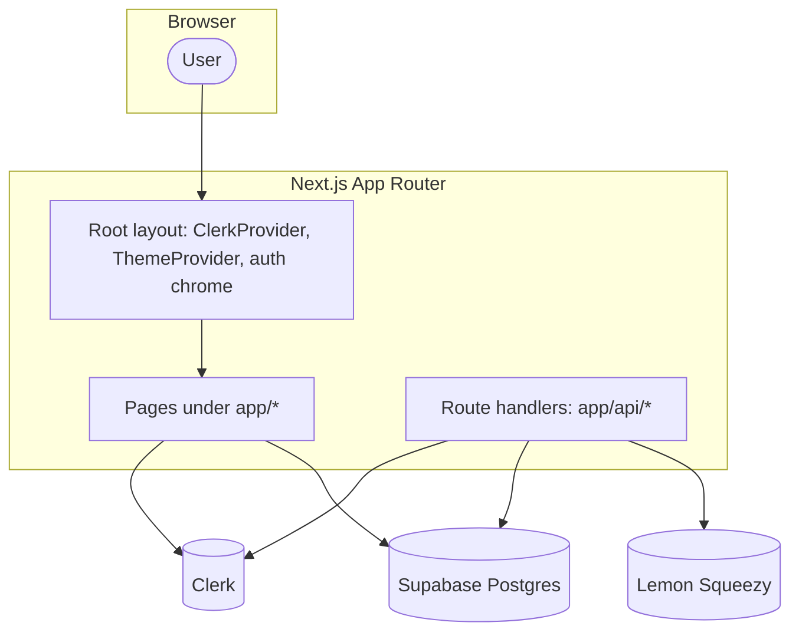

# SeaWolfPrep — Architecture

This document describes how the application is structured today: frameworks, integrations, routing, access control, and main code boundaries.

## Stack

| Layer | Choice |
|--------|--------|
| Framework | **Next.js** (App Router), React, TypeScript |
| Auth | **Clerk** (`ClerkProvider`, server `auth()` / `currentUser()`) |
| Database | **Supabase** (Postgres), accessed server-side via **service role** for purchases/users |
| Payments | **Lemon Squeezy** (hosted checkout + webhooks + optional Orders API for receipts) |
| Styling | Tailwind CSS, shared UI primitives under `components/ui/` |
| Analytics | Vercel Analytics (see root layout) |

## High-Level Diagram

## Repository Shape (Concise)

- **`app/`** — Routes, layouts, metadata. Server Components by default; client islands where marked `"use client"`.
- **`components/`** — Feature UI (dashboard shell, game phases, landing, practice hub, etc.).
- **`lib/`** — Domain logic: scoring (`game-scoring.ts` — treat as canonical per project rules), game helpers/types/visuals, access helpers, checkout URLs, dashboard tier helpers.
- **`utils/supabase/`** — Admin client and helpers (`admin.ts`).
- **`public/`** — Static assets (JSON game config, icons).

## Root Layout

`app/layout.tsx` wraps the app with:

- **ClerkProvider** and a slim global header (sign-in / user button).
- **ThemeProvider** (next-themes) for light/dark.

Individual routes add their own shells (landing navbar/footer, dashboard sidebar, etc.).

## Routing Overview

### Marketing & legal

| Route | Role |
|-------|------|
| `/` | Landing: hero, features, `#pricing`, FAQ, footer |
| `/pricing` | Same pricing UI as landing section; CTAs resolve to Lemon checkout when signed in, else Clerk sign-in + `redirect_url` |
| `/privacy`, `/terms`, `/refund-policy` | Static/legal |

### Product surfaces

| Route | Role |
|-------|------|
| `/game` | Full Sea Wolf simulator (single-page client flow; phases in `components/game/*`) |
| `/solver` | Solver tool UI |
| `/practice` | Practice hub (cards linking to game/solver) |

**Access:** Layout-level guards (see below):

- **`/game`** — Signed-in user with **Simulator** or **Simulator + Solver** purchase (`lib/access.ts` → `userHasAccess`).
- **`/solver`** — Signed-in user with **Simulator + Solver** bundle and/or optional standalone solver variant (`userHasSolverAccess`). Simulator-only tier does **not** unlock solver.

### Authenticated app chrome

| Route | Role |
|-------|------|
| `/dashboard`, `/dashboard/analytics`, `/dashboard/inbox`, `/dashboard/settings` | Dashboard shell with shared sidebar (`components/dashboard/dashboard-sidebar.tsx`). Layout loads Clerk user + Supabase purchases for tier labels and “upgrade” visibility. |
| `/account`, `/account/billing` | Clerk profile / billing summary + Lemon receipt redirect |

### API routes

| Endpoint | Role |
|----------|------|
| `POST /api/webhooks/lemonsqueezy` | Verifies HMAC; on `order_created` upserts `users` and `purchases` (Clerk `user_id` from checkout custom data, variant id, Lemon order id). |
| `GET /api/billing-portal` | Auth required; loads latest `purchases.order_id`; calls Lemon Orders API; redirects to receipt URL (requires `LEMONSQUEEZY_API_KEY`). |

## Authentication & Authorization

- **Identity:** Clerk sessions; server components use `@clerk/nextjs/server` (`auth`, `currentUser`).
- **Entitlements:** Driven by **`purchases`** rows keyed by Clerk **`user_id`** and Lemon **`variant_id`** (string IDs matching public env vars).
- **Helpers:**
  - `lib/require-simulator-access.ts` — `/game`
  - `lib/require-solver-access.ts` — `/solver`
  - `lib/dashboard-sidebar-server.ts` — shared sidebar payload (display name, `resolveTier`, `hasPurchases`)
  - `lib/dashboard-access.ts` — `AccessTier`: `none` | `simulator` | `simulator_solver`

There is **no** Next.js root `middleware.ts` in this repo; gating is implemented in **layouts** and **route handlers** where needed.

## Payments Flow

1. **Checkout:** `lib/checkout.ts` builds Lemon URLs with `checkout[custom][user_id]` and email prefill (`NEXT_PUBLIC_LMS_VARIANT_*` and UUIDs for checkout products).
2. **Webhook:** Lemon posts signed payloads; valid `order_created` events persist purchase metadata to Supabase.
3. **Billing UI:** Settings and `/account/billing` link to **`/api/billing-portal`** for a signed-in user’s personalized receipt URL when configured.

## Data Model (Supabase)

Defined in `supabase/schema.sql` (service-role policies; not end-user RLS for app reads in practice):

- **`users`** — `id` (Clerk user id), `email`
- **`purchases`** — `user_id`, `variant_id`, `order_id` (unique), timestamps

Application reads use **`supabaseAdmin`** (secret key) on the server only.

## Game / Simulator Architecture

- **`app/game/page.tsx`** — Large client component orchestrating steps (`GameStep`), timers, site progression, and behavioural logging hooks.
- **`components/game/GamePhase0Panel` … `GamePhase4TreatmentPanel`** — Phase UIs; shared chrome tokens in `lib/game-phase-layout.ts`.
- **Rules:** Scoring and behavioural aggregates live in **`lib/game-scoring.ts`** and related helpers — avoid divergent scoring logic elsewhere.
- **Content:** Scenario/pool JSON under **`public/`** (loaded by the game client).

The simulator runs **in the browser**; there is no separate game microservice.

## Theming

- Global CSS tokens in `app/globals.css`; dashboard sidebar integrates a compact theme toggle (`components/dashboard/dashboard-sidebar-theme-toggle.tsx`).

## Configuration (Representative Env Vars)

Public / client-safe:

- `NEXT_PUBLIC_*` Clerk, Supabase publishable key, Lemon variant IDs and checkout UUIDs

Server-only:

- Clerk secret, Supabase service secret, `LEMONSQUEEZY_WEBHOOK_SECRET`, `LEMONSQUEEZY_API_KEY`
- Optional: `NEXT_PUBLIC_LMS_VARIANT_SOLVER` if a standalone solver SKU exists

Exact names should match `.env.local` / deployment secrets.

## Operational Notes

- Regenerate **`.next`** if route-type generation breaks after large route tree changes.
- Webhook and billing integrations assume **consistent `user_id` custom field** on checkout (see `getCheckoutUrl`).

---

*This file reflects the codebase as documented here; update it when you change routes, guards, or integrations.*
